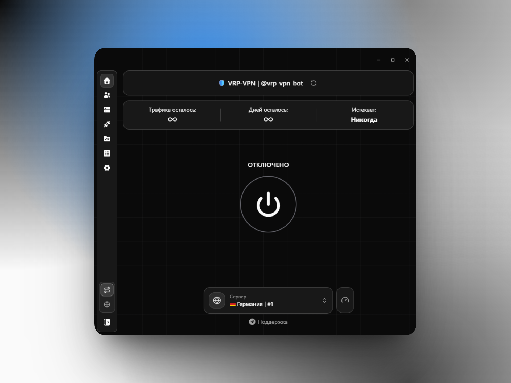
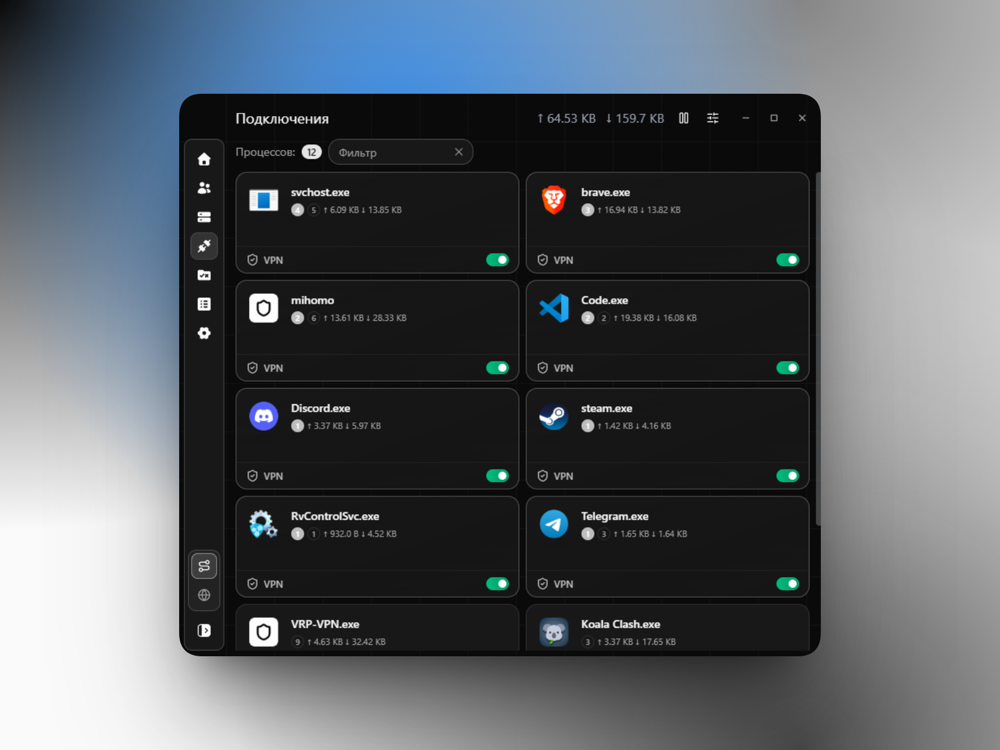

# VRP VPN

<p align="center">
  
  <br>
  <br>
  <a href="https://github.com/Xelbor/vrp-vpn-app/releases">
    
  </a>
</p>

<h3 align="center">GUI-клиент для <a href="https://github.com/MetaCubeX/mihomo">Mihomo</a> с управлением VPN на уровне процессов</h3>

<p align="center">
  <a href="https://www.vrp-vpn.online">🌐 Сайт</a>
  &nbsp;•&nbsp;
  <a href="https://t.me/vrp_vpn_bot">🤖 Telegram-бот</a>
</p>

<p align="center">
  
</p>

## О проекте

**VRP VPN** — форк клиента [Koala-Clash](https://github.com/coolcoala/koala-clash) с ключевыми особенностями.

### 🎯 Главная фишка — управление процессами

VRP VPN позволяет **управлять VPN на уровне отдельных процессов прямо во время работы**. Вы можете на живую отключить VPN для конкретного процесса на ПК — без перезапуска соединения и без правки конфигов. Нужно, чтобы одно приложение шло напрямую, а остальные через туннель? Один клик.

<p align="center">
  
</p>

## Возможности

- [x] **Управление VPN по процессам в реальном времени** — включайте и отключайте туннель для отдельных приложений на лету
- [x] Tun-режим «из коробки» без service mode
- [x] Несколько цветовых тем
- [x] Поддержка большинства опций конфигурации Mihomo
- [x] Встроенные ядра Mihomo (stable и alpha)

## 🚧 В планах на v0.3.0

- [ ] Поддержка протокола **Hysteria2**
- [ ] Поддержка транспорта **xHTTP**
- [ ] **Кастомные темы**, настраиваемые прямо в приложении

## Разработка

### Требования

- **Node.js** >= 20.0.0
- **pnpm** >= 9.0.0
- **Git**

### Технологии

VRP VPN построен на Electron + React + TypeScript.

**Frontend:** React 19, shadcn/UI, Tailwind CSS, Monaco Editor

**Backend:** Electron, Mihomo Core, sysproxy-go

### Быстрый старт

```bash
git clone https://github.com/Xelbor/vrp-vpn-app.git
cd vrp-vpn
pnpm install
pnpm dev
```

Если Electron не устанавливается:

```bash
cd node_modules/electron && node install.js && cd ../..
```

### Структура проекта

```
src/
├── main/               # Основной процесс Electron
│   ├── core/           # Управление ядром Mihomo
│   ├── config/         # Управление конфигурацией
│   ├── resolve/        # Трей, шорткаты, авто-обновление, плавающее окно
│   ├── sys/            # Системная интеграция (sysproxy, autorun)
│   └── utils/          # Утилиты
├── renderer/           # React-фронтенд
│   └── src/
│       ├── components/ # React-компоненты
│       ├── pages/      # Страницы
│       ├── hooks/      # Хуки и context-провайдеры
│       └── utils/      # Утилиты фронтенда
├── preload/            # Preload-скрипты (IPC-мост)
└── shared/types/       # Общие TypeScript-типы
```

### Команды

| Команда | Описание |
|---------|----------|
| `pnpm dev` | Запуск dev-сервера (renderer с hot reload, main требует перезапуска) |
| `pnpm lint` | Запуск ESLint |
| `pnpm format` | Запуск Prettier |
| `pnpm typecheck` | Проверка типов TypeScript |
| `pnpm build:win` | Сборка под Windows |
| `pnpm build:mac` | Сборка под macOS |
| `pnpm build:linux` | Сборка под Linux |

Архитектуру и формат можно задать через флаги:

```bash
pnpm build:win nsis --x64
pnpm build:mac pkg --arm64
pnpm build:linux deb --x64
```

### Артефакты сборки

- **Windows**: `.exe` (NSIS-установщик), `.7z` (portable)
- **macOS**: `.pkg`
- **Linux**: `.deb`, `.rpm`, `.pkg.tar.xz` (pacman)

## Благодарности

Based on [Koala-Clash](https://github.com/coolcoala/koala-clash) by [coolcoala](https://github.com/coolcoala).
